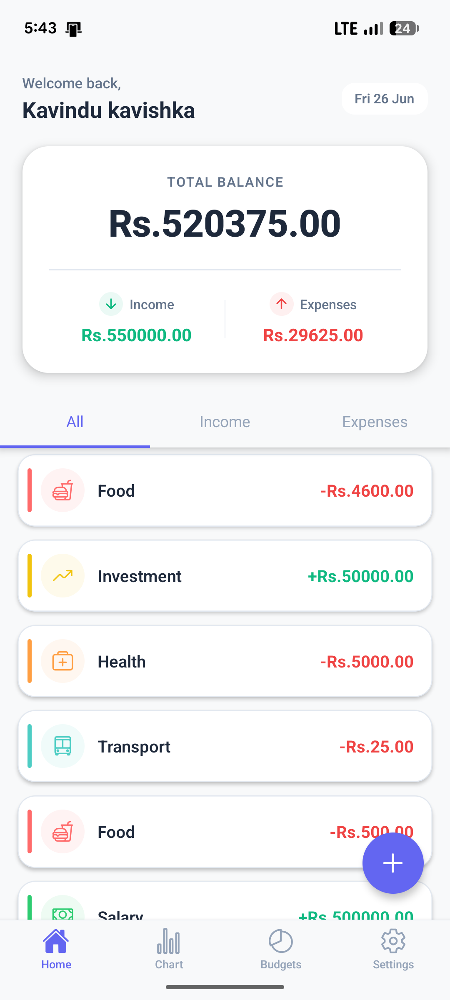
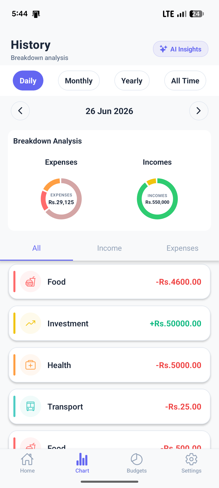
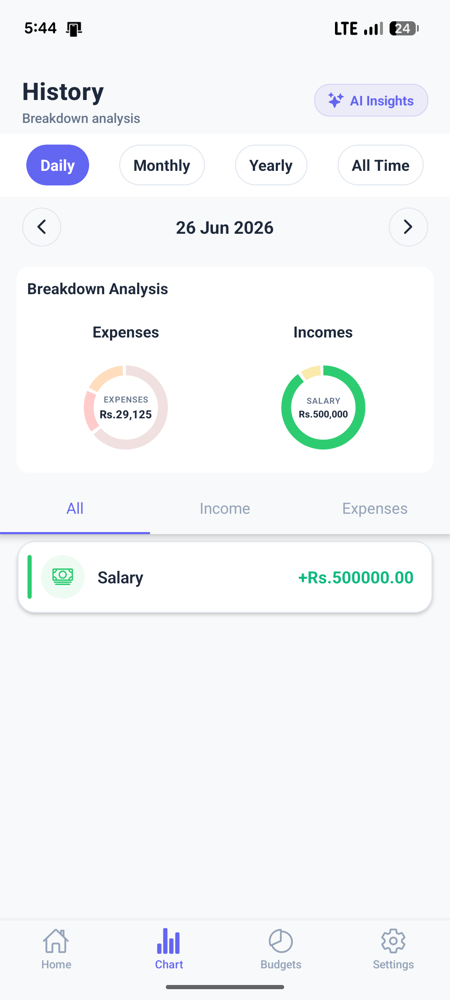
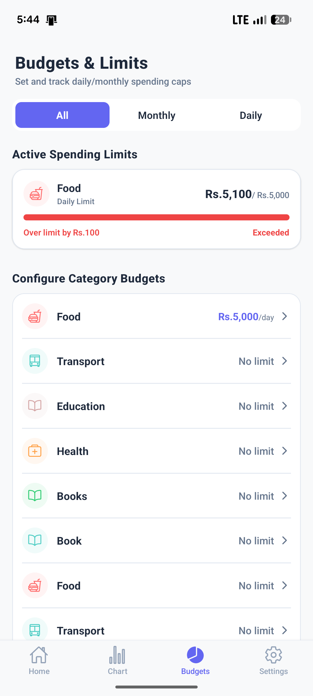
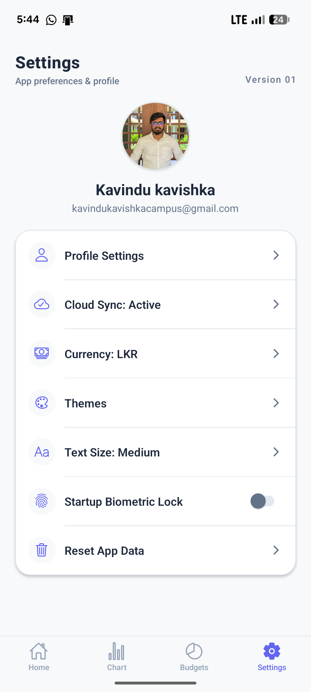
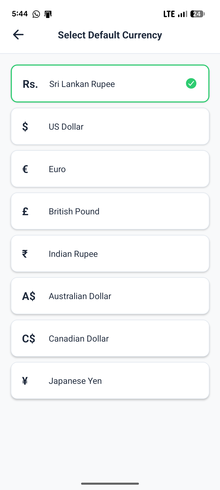
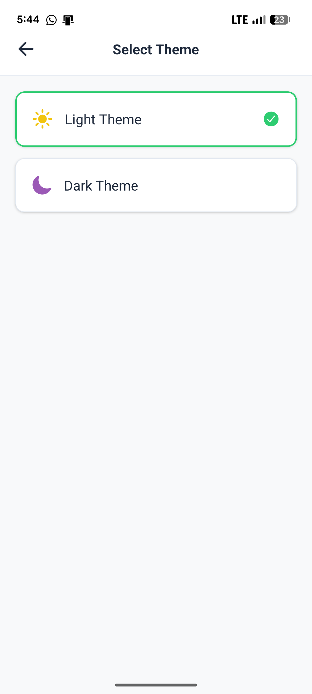
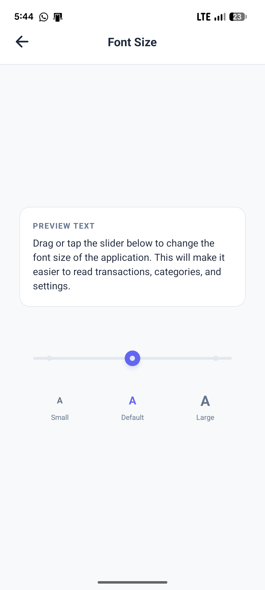

# Money Manager

A comprehensive React Native application for managing your personal finances, built with Expo, Supabase, and Drizzle ORM.

## Features

- **Track Finances:** Manage expenses and income efficiently.
- **Secure Data Storage:** Cloud backend integrated with Supabase.
- **Local Database:** Fast local caching and queries using Drizzle ORM.
- **Smooth Navigation:** Sleek UI flow with React Navigation.

## Screenshots

<table>
  <tr>
    <td></td>
    <td></td>
    <td></td>
    <td></td>
    <td></td>
    <td></td>
    <td></td>
    <td></td>
  </tr>
</table>

## Getting Started

1. **Install dependencies:**
   ```bash
   npm install
   ```

2. **Start the development server:**
   ```bash
   npm start
   ```
